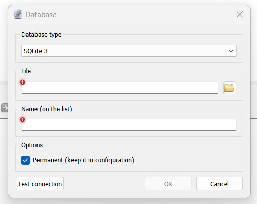

## Install and usage of a database
<section>
In this section you will learn how to **install** *SQLiteStudio*, **create** your first very own *database* and **add** some *tables* with different *columns*.

In our example we are using SQLite (https://www.sqlite.org/index.html) and the SQLiteStudio (https://sqlitestudio.pl/). You can download a version for your Linux, Mac or Windows system here (https://github.com/pawelsalawa/sqlitestudio/releases). **Follow the instructions of the installer and open the client after you're done.**

### Creating a database, tables and columns
First steps:

* was auch immer
* 
* test2

### Enter data into your database (manual and csv import)

</section>