<!--

title: "Publishing Data Online"

author: "Lizzie Scholtus"

footer: Research Data Management, 10-14 July 2023, Kiel

institute: Institut für Ur- und Frühgeschichte

language: en

icon: https://www.uni-kiel.de/ps/cgi-bin/logos/files/cau/norm-en/cau-norm-en-lilagrey-rgb.svg

version:  1.0

language: en

narrator: English Female

tags: research data management, databases, archaeology, data types, data structures, metadata

comment:  Presentation for full day workshop "Introduction to Research Data Management" Summer School 2023, mixed target group (students, PhDs)

-->

# Publishing Data Online
**Lizzie Scholtus**  

Institut für Ur- und Frühgeschichte  

Research Data Management, 10-14 July 2023, Kiel

# Why publishing data?

## Why publishing data online?

    

- To share data
  
  - Open Science
  
  - FAIR Principles

## Why publishing data online?

  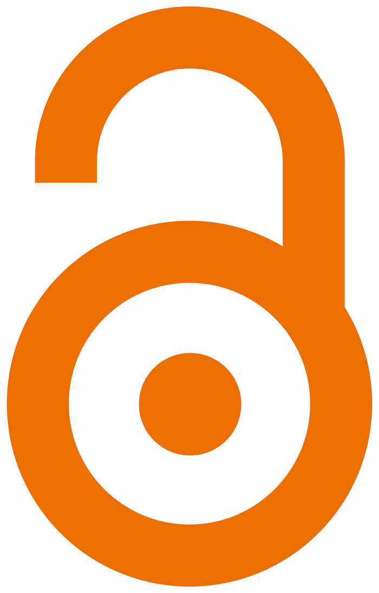

    

What is Open Science?

- Free access to:

  - Scientific publications

  - Research data and metadata

  - Hypothesis, methodologies, protocols, codes, formats and results

- Participative science

<small>
*Pillars of the Open Science*  

*according to UNESCO's 2021 Open Science recommendation.*  

Source: [Wikipedia](https://en.wikipedia.org/wiki/Open_science)

</small>

## What is Open Science?

  

    

- An organised community of various disciplines with convergent practices  
[Manifeste des Digital Humanities](https://books.openedition.org/oep/235)

- A government strategy

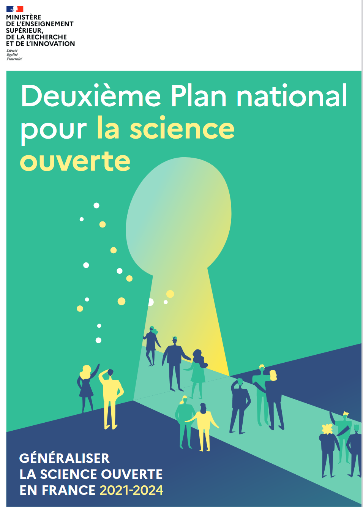

<small>
*French national plan for Open Science*  

Source: [French Ministry of Higher Education and Research](https://www.enseignementsup-recherche.gouv.fr/fr/le-plan-national-pour-la-science-ouverte-2021-2024-vers-une-generalisation-de-la-science-ouverte-en-48525)

</small>

## What are the FAIR principles?

 

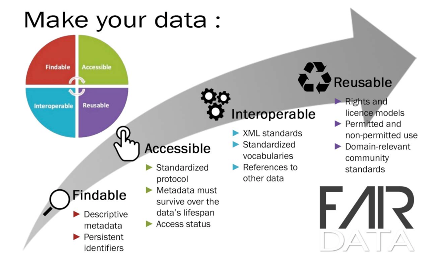

## Why publishing data online?

- To share data

  - Open Science

  - FAIR Principles

- To save data

  - Digital data can die

    - Accident

    - Software evolution

  - Version control

# Where to publish data

## Where to publish data?

 

- Institutional

  - EU, Country, University

- non-specialist

- To deposit the data as it is

  - Private (personal or institutional cloud)

  - Public ([Zenodo](https://zenodo.org/), [Nakala](https://nakala.fr/), [HAL](https://hal.science/), [opendata@uni-keil](https://opendata.uni-kiel.de/content/index.xml)...)

  - Both ([Gitlab](https://about.gitlab.com/), [Github](https://github.com/))

- Private

  - Free or not

- Field specialised

- To share the data with other datasets

  - ([Ariadne](https://portal.ariadne-infrastructure.eu/), [ArkeoGIS](https://arkeogis.org/), Landman...)

    

  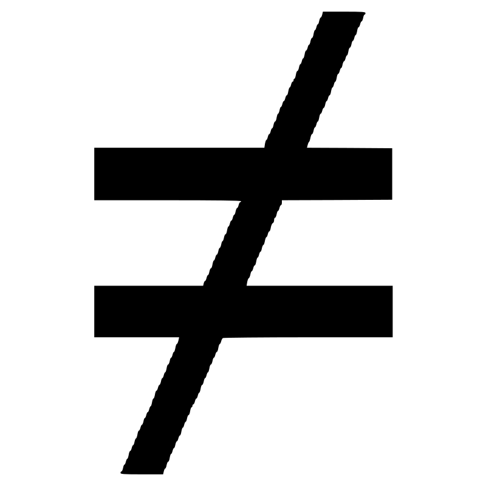 <!-- width = "50px"-->

     

- To create your database ([Heurist](https://heurist.huma-num.fr/heurist/startup/))

 
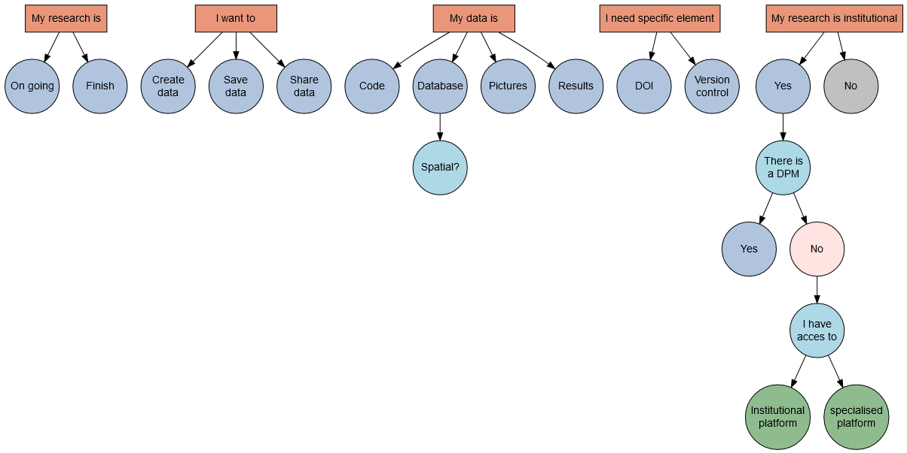

# Three platforms, Three uses 

## Git Platforms 

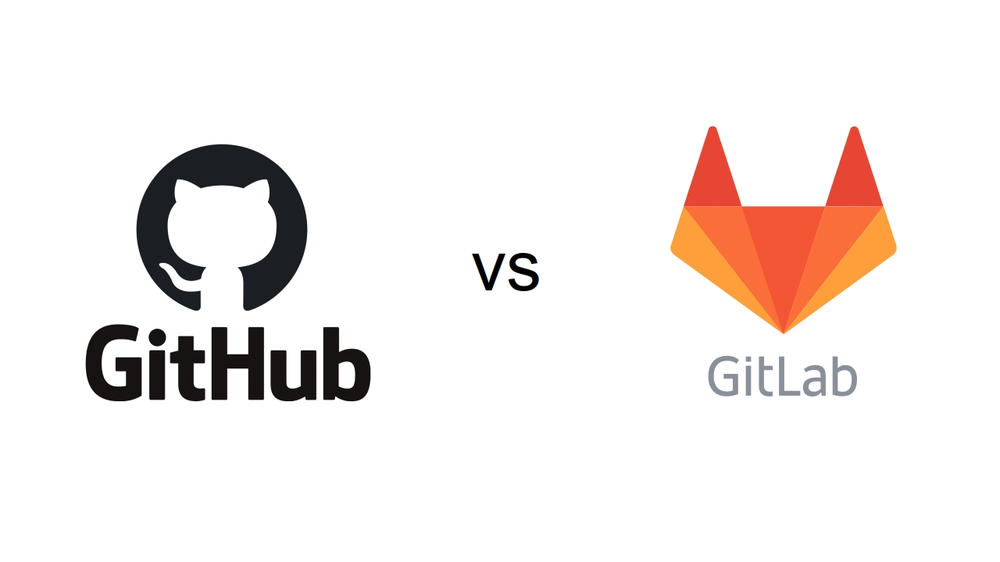

## Git Platforms

[<!-- width = 75px -->](https://github.com/)

- Oldest (2008)

- More people

- Bought by Microsoft

- Less ready to use

  - Users need to pay to integrate elements themselves from third-party application

[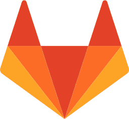<!-- width = 75px -->](https://gitlab.com/)

- Open source

- Completely free at the beginning (not any more)

- continuous integration and DevOps workflows

- Need a paid account for some functionalities

## [Gitlab](https://gitlab.com/)

**Description**

- Dedicated to versioning
- Collaborative work
- Code development

**Inconvenients**

- works with command lines
- Only a depot, not a real publication

**Advantages**

- Branch system
- Continuous integration
  - Standalone [pages](https://lscholtus.gitlab.io/arkeogis-tutoriels/Alignment.html)
  - [Website](https://lscholtus.gitlab.io/mosaicdata/)
- Deposit can be private or public
- Licence attribution
- institutional instance exist

::: {.notes}

- Description: more for code deposition but can be with data
- Inconvenient
  - not easy to use > Git
  - Exist with software but need to be learned
  - not a real publication > not citation, no DOI
- Advantages
  - Branch > allows every author and collegue to work on its part and then merge it to the whole project
  - Standalone pages > allows creation of html pages > easy diffusion with no obligation  
        > website
    
:::

## [Zenodo](https://zenodo.org/) 

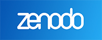

**Description**

- Dedicated to dataset deposit
- Code can also be deposit
- Created By CERN

**Inconvenients**

- Not possible to modify a file
- Fix deposit as for a publication

**Advantages**

- DOI (Digital object identifier)
- Enables easy citation
- Various metadata
- Version control
- Deposit can be private or public
- Licence attribution

::: {.notes}

- Description: 
  - Created by CERN to follow the Open Science recommandation
    - It is institutionnal > maintained by CERN and EU
- Inconvenient:
  - Not possible to just modify a file, it needs to be supress and reupload
  - the deposit is fixed, as it is for a publication
- Advantage:
  - Gives a DOI to new publication (if there is already one you can just link it)
  - Various metadata: can document precisely the data and the project and link it to every other publication

:::

## [ArkeoGIS](https://arkeogis.org/)

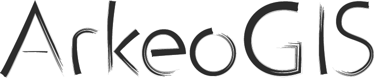

**Description**

- Geographical informatic system online
- specific to data of the past
- Created by Strasbourg university

**Inconvenients**

- Support only spatial data
- Only datasets
- Data need to be aligned to ArkeoGIS structure

**Advantages**

- Data link with other datasets
- Automatic language alignement
- Automatic chronological alignement
- LOD (Link Open Data)
- DOI

## [ArkeoGIS](https://arkeogis.org/)

{width=150}

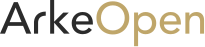{width=150}

**Description**

- Geographical informatic system online
- specific to data of the past
- Created by Strasbourg university

**Inconvenients**

- Support only spatial data
- Only datasets
- Data need to be aligned to ArkeoGIS structure

**Advantages**

- Data link with other datasets
- Automatic language alignement
- Automatic chronological alignement
- LOD (Link Open Data)
- DOI
- Data under password login or completly [open](https://arkeopen.org)

# What is LOD?

## What is LOD? (Link Open Data)

- Linking online data together using:
  - Semantic web
  - Uniform Resource Identifier (URI)
  - Detailed metadata
  - Resource Description Framework (RDF)

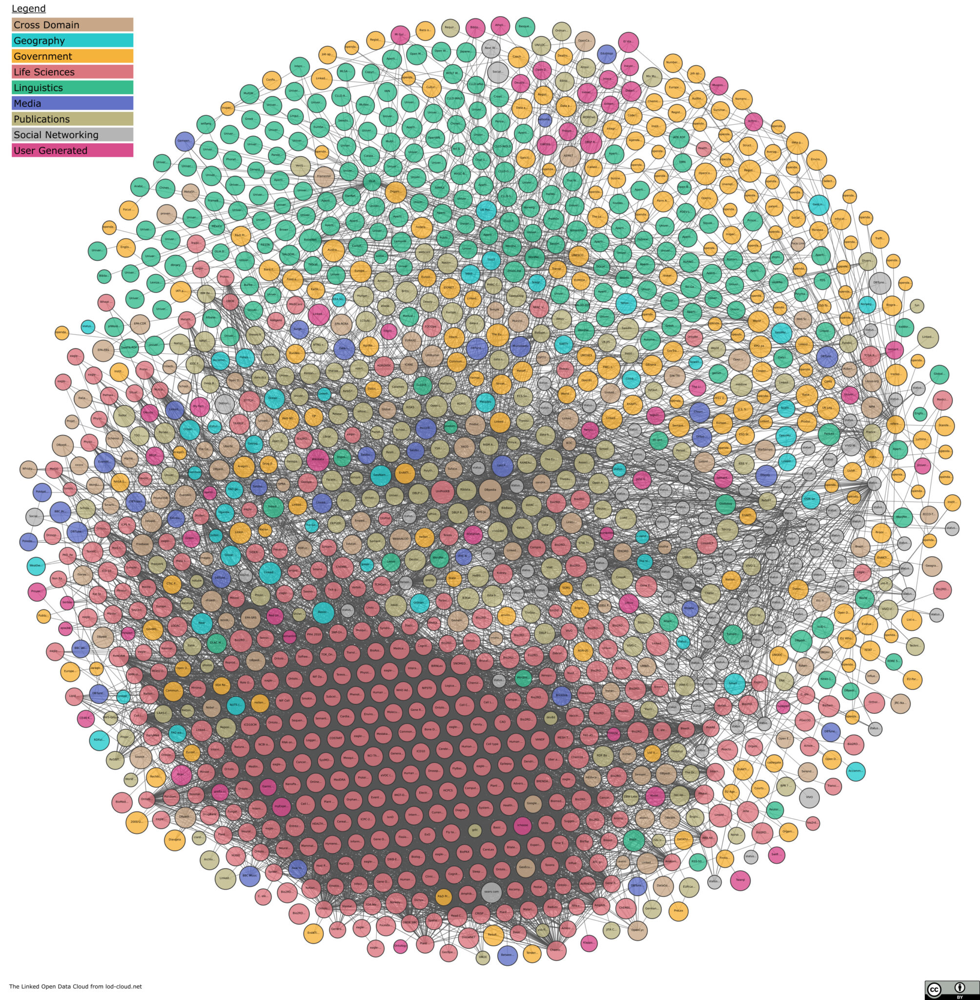

- WEB3.0 = instead of having isolated data repositories, linking them to create a global network. The link is build through internet (data must be online), using:
  - semantic web
  - URI
  - Metadata
  - Resource Description Framework (RDF) = model to describe online data using subject-predicate-object form

## What is Semantic Web?

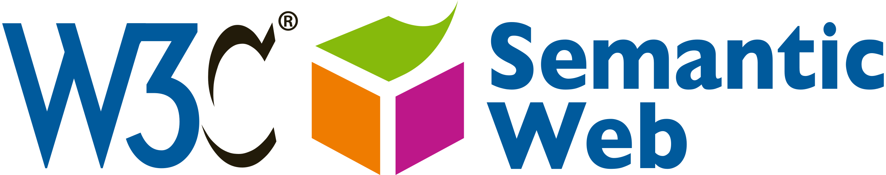

- Structure and link information online
  
  - Using ontologies to build conceptual data modelling

  - Using normalised vocabularies
    - [Getty AAT](https://www.getty.edu/research/tools/vocabularies/aat/) for patrimonial data
    - [PACTOLS](https://pactols.frantiq.fr/opentheso/) for patrimonial data
    - [GeoNames](http://www.geonames.org/) for places
    - [Periodo](https://client.perio.do/?page=open-backend) for chronologies
    - [VIAF](https://viaf.org/) for people

- Enables data browsing

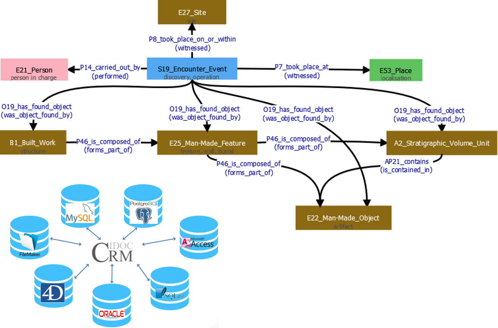
*Conceptual model based on [CIDOC CRM](https://cidoc-crm.org/) ontology*

  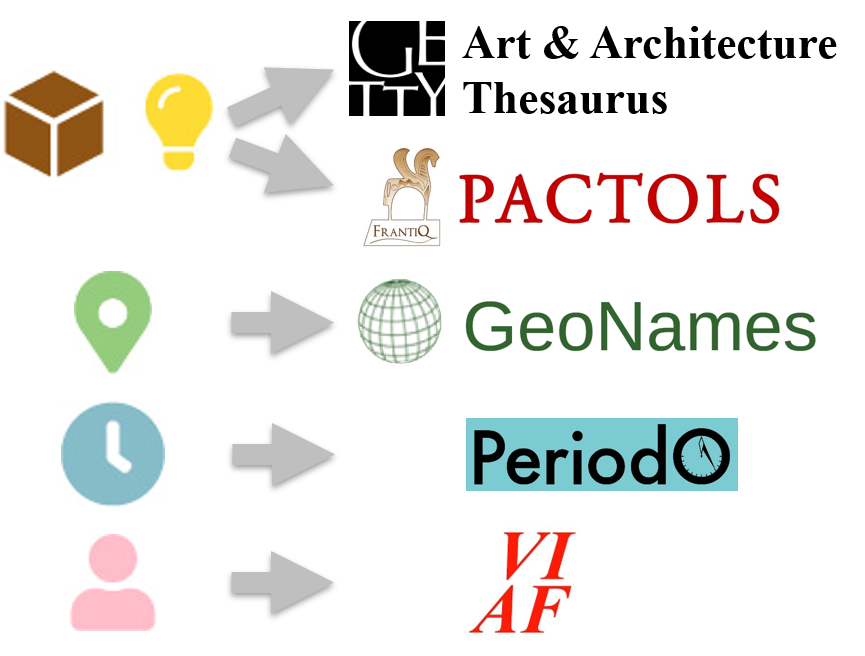

  [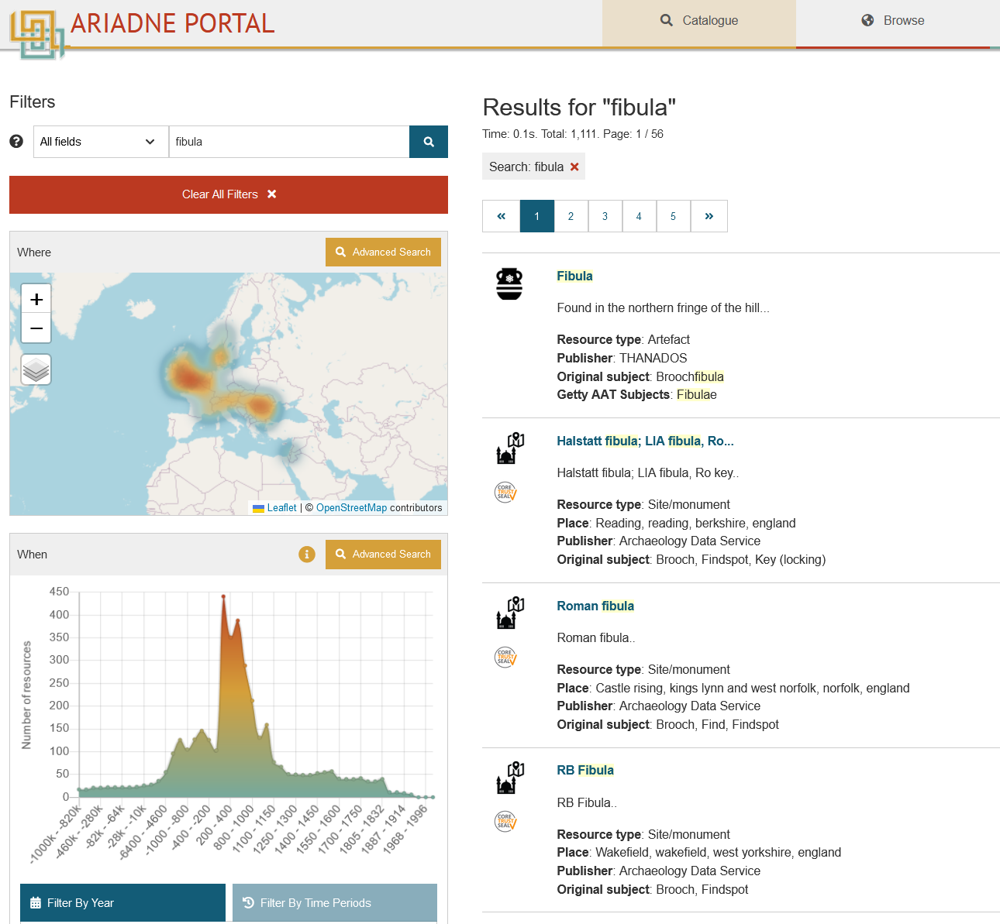](https://portal.ariadne-infrastructure.eu/search?q=fibula)
  
  [A new platform for humanities](https://gotriple.eu/fr)

- Ontologies to allow communication between each database
  - link database variables to concept
- Structure vocabularies = thesaurus
  - various online allowing to link data to specific terms
  - generaly multilingual > link different languages database together
  - A same word can be written in different ways, with the link to a thesaurus it will always refer to a specific term
  
- All of this is how the whole web is constructed and it is how we can use browsers to look for webpages

# What does this mean for you?

## What does this mean to you?

- The first step is to structure your data
- Always precise your data with metadata
- If possible use free format
- Place your data in permanent backup structures (institutional or not) >> DMP
- Specify licences and where possible use the most open ones

  

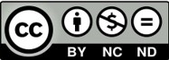

::: {.notes}
To integrate best practice standards, you don't have to respect them all! It is possible to apply only some of them initially = habits to have when creating data:

- Structure the data >> avoid text fields wherever possible and use controlled fields in databases.
- link metadata to your dataset (even a simple txt file next to the database work)
- as far as possible, use free formats >> ensure data longevity (it will still be possible to access it in 10 years' time)
- place your data in permanent backup structures (institutional or not) >> not just on your computer and then you forget that the data exists >> In connection with the DMP
- specify licences and if possible leave them open (open does not mean necessary free)
:::

# The French Data Management Environment

## A government strategy

- National plan for Open Science
- Law for a numerical Republic
- Aim:
  - Research Data Management on a national level
  - Dissemination and reproducibility

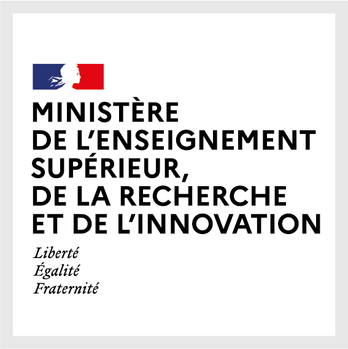

## Huma-Num

::: {.notes}

This government strategy is reflected in the French research landscape through the Huma-Num infrastructure
- Mission = to create a digital infrastructure enabling Humanities communities to develop, implement and preserve research programmes - and their data and tools - over the long term, in a context of open science and data sharing. 
- but put in place practices and tools for Humanities communities
- in accordance with the FAIR principles

:::

## MASA

::: {.notes}

Huma-Num is organised into consortia to support each discipline.
Since 2013, the MASA (Mémoire des Archéologues et des Sites Archéologiques) consortium has been helping archaeologists to digitise and make available their excavation archives.
- is working to disseminate the precepts of the FAIR principles within the French archaeological community.
The aim is to help archaeologists make their data interoperable and open up their datasets on the web, while ensuring that they are safeguarded.

:::

## MASA Digital Ecosystem

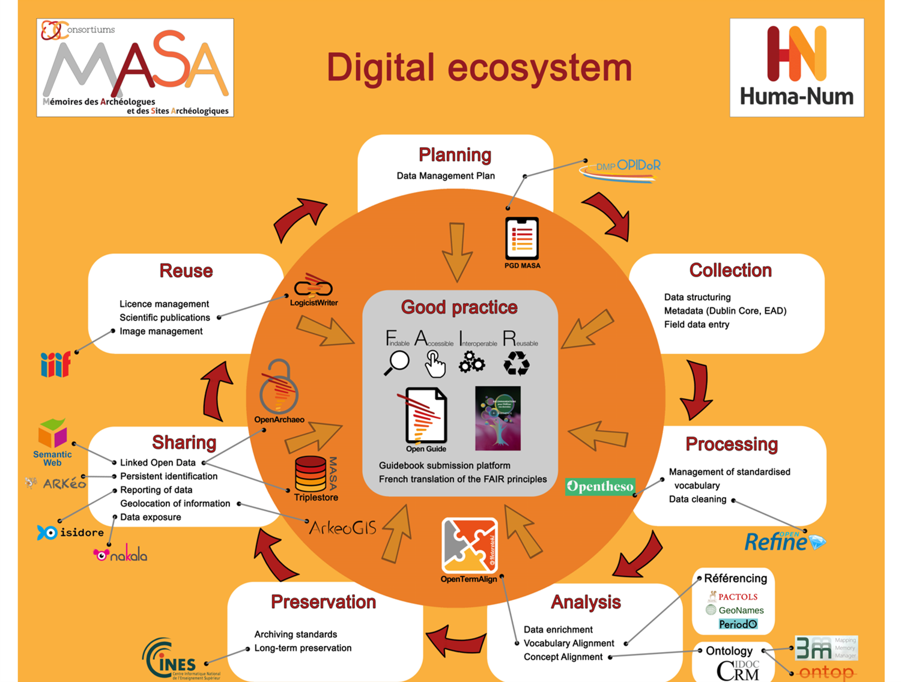

::: {.notes}

The MASA digital ecosystem is designed to help archaeologists.
It is based on the famous data life cycle.
The aim is to identify existing tools (or, if they are lacking, to put them in place) and to provide best practices to make the task easier for researchers, from the data acquisition phase through to reuse.

It follows the same steps as those defined by Huma-Num, but with specific tools for archaeologists.

These best practices are structured around the FAIR (Easy to Find...) principles.

:::
